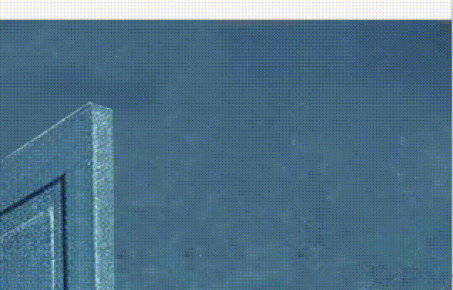

# 动静之间

（互动媒体课程作业，以下全是个人观点不喜勿拍~）

## PART 1.梦与幻想

超现实主义艺术是一门描绘梦的画笔。

梦是无形的，超现实主义画家将它们留在纸上。放弃经验记忆，放弃普遍逻辑，着重于描绘人们内心的世界，超现实主义艺术以现实的对立面出现，给身处现实世界的人们以美感的慰藉。


*《记忆的永恒》是达利(salvador dali)最负盛名的一幅画，也是超现实主义艺术最具代表性的作品*

达利一生中创作了无数难以解读的作品。除了油画外，他还为故事书创作插图，也留下了一些雕塑作品。在他的油画和插画作品中，反复出现百合花与蚂蚁、极尽奢华的美食和细长四肢的怪兽。**令人感到讽刺的是，超现实主义作品通常倾向于剥离意向的现实意义，但最著名的反而是这样一幅“仿佛能解释出一些意义”的作品。**

作为一位成功自我营销的艺术家，达利满足一切大众对于艺术家的幻想：英俊、自恋、离经叛道。（表现得像个“艺术家”会比较容易出名，这样的例子还有卡拉扬和杜尚）

*选了一幅很具有代表性的作品。去年达利插画手稿在国内展出，三百多张插画都是类似的画风。放弃逻辑性的表达使这样的绘画很像AI生成的作品*

与达利对意象本身的重构不同，同时期、同流派的马格里特(René Magritte)更倾向于探究事物之间的关系。他的作品通常沉静而忧郁：


*《the son of man》，马格里特的代表作之一，同样难逃被解读一番的命运*

作为与达利齐名的画家，马格里特在国内似乎鲜为人知。他没有花太多精力去经营自己在公众眼中的形象，时至今日，他的经历仍像诗一样神秘。马格里特像梵高一样，在去世后才为世人所重视（好在他生前没有梵高那么惨），但他的作品对超现实主义艺术和当代插画都构成了深远的影响。


*马格里特的典型作品。他喜爱的意象只有几个，形象也很稳定：西装男人、飞鸟、天空、新月和绿苹果。这些意象能覆盖他十之八九的作品，也能打动人们的内心。*

对比之下可以感受到这幅作品有一种呼之欲出的静谧。

## PART 2.动静之间
为什么同样是静态的绘画作品，不同画家的笔下能产生动静之别呢？是因为他们表现的画面有动静之别吗？


*Jarek Puczel. 奔跑的孩子和即将破碎的肥皂泡。转瞬即逝的场景，寂静的观感。*


*Alexei Antonov. 虽然场景是静物，仿佛能看到云卷云舒的天空和不断升起的太阳。*

可见画面感的动静之别不在于画家意在表现的场景，而在于色彩与形状的把控。**色彩变化快、难以形成大面积色块的画面通常富有动感；颜色稳定，边界规整的画面显得更加静谧。**

这也就是为什么莫奈和梵高的画富有动感。印象派的画家们喜欢用破碎的色块来编织画面。


*Claude Monet-83 埃特尔塔西的悬崖，这幅画的海报贴在我宿舍的墙上。*


**以上内容仿佛和我的作业没什么关系。**

---

## PART 3.我的实现

重新来看马格里特，我挑选了两幅作品，一动一静，来创作他们的动态版本.

富有动感的作品。形态各异的人飘在空中。


这幅作品可以说是我在原作的基础上加上自己的理解了。原作西装男可能是漂浮在空中，可能向上或向下，但以我的理解是倾向于下落的。马格里特的画作中很少见积极、活泼的情绪，下落比较符合他作品冷静的风格。


气氛静谧的作品，从蓝色的主色调和平稳的用色可以看出。


马格里特很喜欢把天空作为非现实的一部分，为天空增添动态效果能让画面的虚幻感更强烈。闪烁的烛光和漂浮的云不会因为动起来而破坏了原来静谧的感觉。


强烈建议直接在processing里运行这两个文件，gif图有丢帧的情况。

### 实现详细
#### work1
每个~~跳楼~~下落的人是一个类的实例化对象：
```
class Man(object):
    def __init__(self,xpos,ypos,idx,siz):
        self.x=xpos
        self.y=ypos
        self.idx=idx
        self.siz=siz
```

`idx`对应了不同姿势的人，一共有五种。


`siz`是人的大小。可见原作有三层，其中最后一层在红顶房屋之后，其余两组在房屋之前。


这部分的逻辑大概是：

- 指定三个西装男矩阵的横纵间隔和大小，随机化`idx`
- 每轮画完一个西装男，对`self.y`更新

#### work2
好看的云，画了一点时间。
云是由一组不同位置、不同大小、不同透明度的圆组成的。这些圆是以**一生二**的形式随机生成的，实现的数据结构是粒子系统。
```
class Particle
{
  PVector position;
  float oppacity;
  float w;
  color clr;
  boolean alive;
```
对于每一个圆，有以上5个属性。w是圆的半径，clr是云的颜色，alive是用来标记这个圆是否已经“生小圆”了。
```
  protected Particle(float x, float y, float wth, color c, float o)
  {
    position = new PVector(x, y);
    w = wth;
    clr = c;
    oppacity = o;
    alive = true;
  }
  ```
  初始化粒子

  ```
  public void reproduce()
  {
    if(w > 1)
    {
      for(int i = 0; i < 2; i++)
      {
        float newX = position.x + random(-w, w);
        float newY = position.y + random(-w/2, w/4);
        float r = random(10);
        float newW = w - r;
        if(newW < 1)
          newW = 1;
        particles.add(new Particle(newX, newY, newW, clr, oppacity));
        alive = false;
      }
    }
  }
  ```
  生小圆的过程。新建的小圆在原来点周围随机地生成，半径减小。被放到与大圆同一个数组里。新的`w<1`以后就不拓展了。
  ```
  public void drawParticle()
  {
    fill(clr, oppacity);
    ellipse(position.x, position.y, w, w);
  }
}
```
把圆画到sketch上。


画云的过程：
```
  pushMatrix();
  translate(trX,0);
    for(int i = 0; i < particles.size(); i++){
      Particle p = (Particle) particles.get(i);
      p.drawParticle();
      
  }
  popMatrix();
```
我把遍历数组的loop放慢，可以看到云生成的过程：



`trX`是云移动的`x`值。每轮更新。
无论创建多少朵云，组成这些云的小圆只存在一个统一的数组中。

闪烁的月光/烛光：
```
  float Fsiz=sin(lop)+5;
  float Insiz=1;
  for(int i=0;i<10;i++){
     fill(color(206,222,206), opt);
     ellipse(width/2, 200, Fsiz*Insiz, Fsiz*Insiz);
     Insiz+=2;
  }
  lop +=0.2;
  if(lop>2*3.141){
    lop=0;
  }
```
通过画一系列半透明的同心圆来实现的渐变效果。因为是半透明的原作中笔触的质感也得以保留。
`Fsiz`是控制一系列圆的统一大小的参数，控制不同帧中光圈的大小，达到一闪一闪的效果。
`Insiz`是每loop中各同心圆的半径。
### 手绘作品


我应该用IPad画的这个水彩画画好丑qaq

### 一些感想

- 既然我永远不会成为TA方向的大佬，在艺术与技术之间找点乐子也不枉学了数字媒体技术专业。
- 这次没太考虑算法方面的创新，单纯想对自己喜欢的作品再创作而已。
- 我真的无法get到达利的点，上次去看他的画展感觉其实就是瞎画的吧（不）
- 上面提到的Antonov是超写实流派，挺喜欢的。还有一位叫张青的画家，之前看展的时候好像和冷军展在一起的，他的静物也给人一种很平静的感觉 >w<
- 所以说起来画也好，电影也好，我还是更愿意接受国内的作品，大环境相同就很容易引发共情。于我来说，艺术作品的情感价值也要高于它是不是“好看”。变形金刚就很难有那种“虽世殊时异，所以兴怀，其致一也”的感觉，特效总会发展的。但看到丰子恺、老树他们时，我总有一种“是的，我活在这里”的感觉，这种感觉就很好。
- 等等是不是扯远了

### 参考资料：
https://en.wikipedia.org/wiki/Ren%C3%A9_Magritte
https://en.wikipedia.org/wiki/Surrealism
https://www.openprocessing.org/
